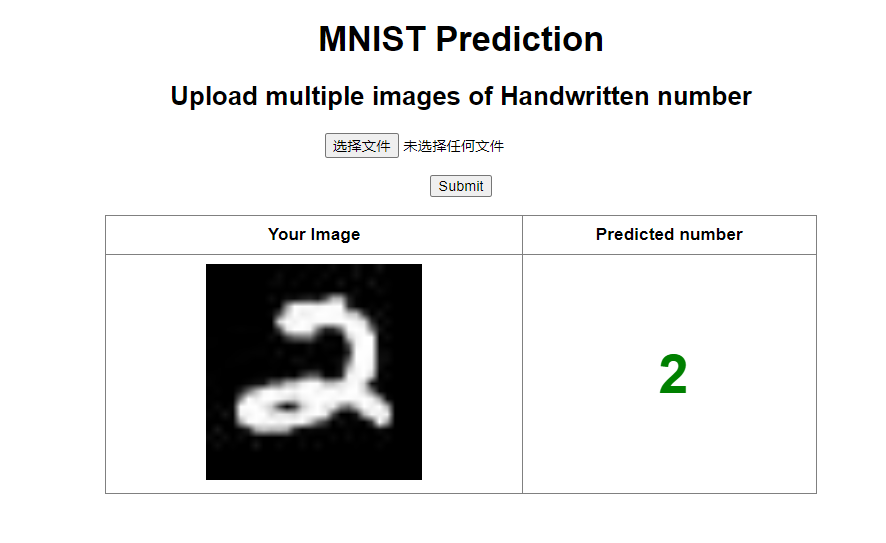

 # 训练出模型
 ```
python train.py
 ```

# 模型数据格式转换
```
torch-model-archiver --model-name mnist --version 1.0 --model-file model.py --serialized-file mnist_cnn.pt --handler handler.py --export-path /data/output/

# 存储到/data/output目录下
```

# docker部署torchserve服务
```
镜像：pytorch/torchserve:0.7.1-gpu
docker run --gpus=1 --rm -p 3000:8080 -p 3001:8081 -p 3002:8082 --name test_pytorch_mnist -v /data/output:/home/model-server/model-store pytorch/torchserve:0.7.1-gpu
```
## 注册模型
```
# 请求服务
curl "http://localhost:3001/models"

(base) [root@host-135 data]# curl "http://localhost:3001/models"
{
  "models": []
}

# 注册模型
(base) [root@host-135 data]# curl -v -X POST "http://localhost:3001/models?initial_workers=1&synchronous=false&url=mnist.mar"
*   Trying ::1...
* TCP_NODELAY set
* Connected to localhost (::1) port 3001 (#0)
> POST /models?initial_workers=1&synchronous=false&url=mnist.mar HTTP/1.1
> Host: localhost:3001
> User-Agent: curl/7.61.1
> Accept: */*
> 
< HTTP/1.1 202 Accepted
< content-type: application/json
< x-request-id: 12d5c213-d995-4973-9cba-f2c7aa559950
< Pragma: no-cache
< Cache-Control: no-cache; no-store, must-revalidate, private
< Expires: Thu, 01 Jan 1970 00:00:00 UTC
< content-length: 47
< connection: keep-alive
< 
{
  "status": "Processing worker updates..."
}
* Connection #0 to host localhost left intact

# 更改服务配置
(base) [root@host-135 data]# curl -v -X PUT "http://localhost:3001/models/mnist?min_worker=3"
*   Trying ::1...
* TCP_NODELAY set
* Connected to localhost (::1) port 3001 (#0)
> PUT /models/mnist?min_worker=3 HTTP/1.1
> Host: localhost:3001
> User-Agent: curl/7.61.1
> Accept: */*
> 
< HTTP/1.1 202 Accepted
< content-type: application/json
< x-request-id: 9f80db68-e1aa-4990-b0ea-61053cf48637
< Pragma: no-cache
< Cache-Control: no-cache; no-store, must-revalidate, private
< Expires: Thu, 01 Jan 1970 00:00:00 UTC
< content-length: 47
< connection: keep-alive
< 
{
  "status": "Processing worker updates..."
}
* Connection #0 to host localhost left intact

# 查看模型服务
(base) [root@host-135 data]# curl "http://localhost:3001/models/mnist"
[
  {
    "modelName": "mnist",
    "modelVersion": "1.0",
    "modelUrl": "mnist.mar",
    "runtime": "python",
    "minWorkers": 3,
    "maxWorkers": 3,
    "batchSize": 1,
    "maxBatchDelay": 100,
    "loadedAtStartup": false,
    "workers": [
      {
        "id": "9000",
        "startTime": "2024-04-09T07:58:58.729Z",
        "status": "UNLOADING",
        "memoryUsage": 0,
        "pid": 1537,
        "gpu": true,
        "gpuUsage": "gpuId::0 utilization.gpu [%]::0 % utilization.memory [%]::0 % memory.used [MiB]::0 MiB"
      },
      {
        "id": "9001",
        "startTime": "2024-04-09T08:00:29.473Z",
        "status": "UNLOADING",
        "memoryUsage": 0,
        "pid": 1753,
        "gpu": true,
        "gpuUsage": "gpuId::0 utilization.gpu [%]::0 % utilization.memory [%]::0 % memory.used [MiB]::0 MiB"
      },
      {
        "id": "9002",
        "startTime": "2024-04-09T08:00:29.473Z",
        "status": "UNLOADING",
        "memoryUsage": 0,
        "pid": 1749,
        "gpu": true,
        "gpuUsage": "gpuId::0 utilization.gpu [%]::0 % utilization.memory [%]::0 % memory.used [MiB]::0 MiB"
      }
    ]
  }
]
```

## 监控显卡使用情况
```
(python3.9) [root@host-135 src]# nvidia-smi
Fri Apr 12 15:40:11 2024       
+-----------------------------------------------------------------------------+
| NVIDIA-SMI 525.116.04   Driver Version: 525.116.04   CUDA Version: 12.0     |
|-------------------------------+----------------------+----------------------+
| GPU  Name        Persistence-M| Bus-Id        Disp.A | Volatile Uncorr. ECC |
| Fan  Temp  Perf  Pwr:Usage/Cap|         Memory-Usage | GPU-Util  Compute M. |
|                               |                      |               MIG M. |
|===============================+======================+======================|
|   0  Tesla P4            Off  | 00000000:17:00.0 Off |                    0 |
| N/A   49C    P0    23W /  75W |    748MiB /  7680MiB |      0%      Default |
|                               |                      |                  N/A |
+-------------------------------+----------------------+----------------------+
|   1  Tesla P4            Off  | 00000000:98:00.0 Off |                    0 |
| N/A   32C    P8     6W /  75W |      0MiB /  7680MiB |      0%      Default |
|                               |                      |                  N/A |
+-------------------------------+----------------------+----------------------+
                                                                               
+-----------------------------------------------------------------------------+
| Processes:                                                                  |
|  GPU   GI   CI        PID   Type   Process name                  GPU Memory |
|        ID   ID                                                   Usage      |
|=============================================================================|
|    0   N/A  N/A    195246      C   /usr/bin/python3.8                746MiB |
+-----------------------------------------------------------------------------+
```

# 启动app应用，并测试
```
python application/app.py
```
